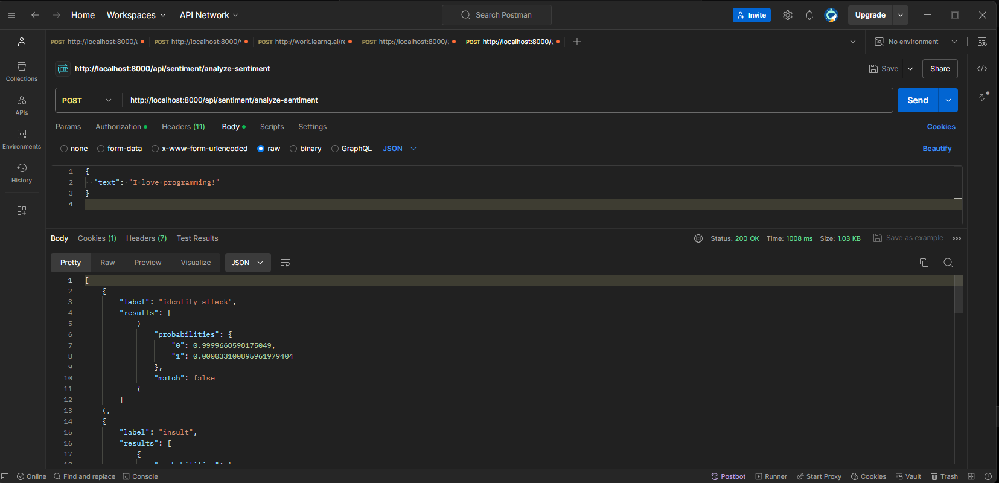
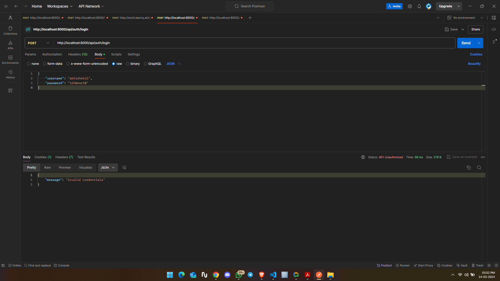
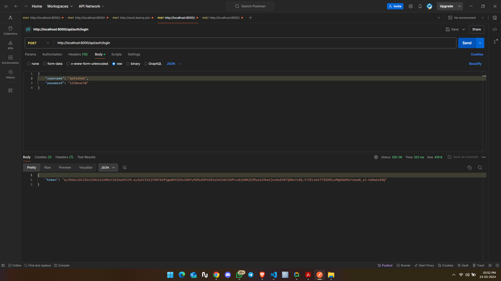
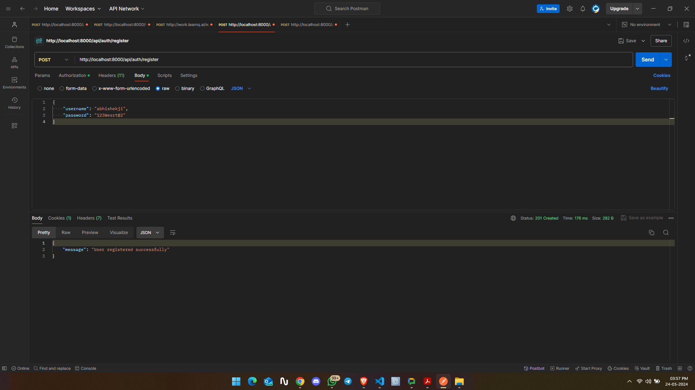
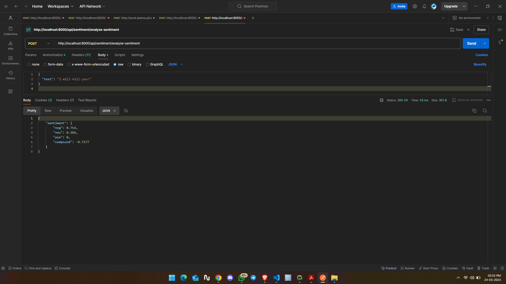

# Backend Server Application README

This repository contains the source code for a backend server application that integrates a pre-trained machine learning model for sentiment analysis with a secure file handling system. The application is built using Express.js and MongoDB.

## Table of Contents

- [Requirements](#requirements)
- [Getting Started](#getting-started)
- [Project Structure](#project-structure)
- [API Endpoints](#api-endpoints)
- [Sample Code Snippets](#sample-code-snippets)
- [Contributors](#contributors)
- [License](#license)

## Requirements

### 1. Machine Learning Model Integration

- Integrated a pre-trained sentiment analysis machine learning model using VaderSentimentAnalysis with the server.
- Implement an API endpoint that accepts text input and returns the sentiment analysis results (positive, negative, or neutral).

### 2. Secure File Handling

- Developed an API endpoint that accepts file uploads (audio, video, PDFs) and securely stores them in MongoDB.
- Implemented authentication for the file upload endpoint using JWT (JSON Web Tokens).
- Ensured that the uploaded files are validated for content type and size limitations.
- Implemented secure access controls to ensure that only authorized users can upload and access the files.

### 3. NoSQL Database Integration

- Integrated MongoDB with the server for storing both textual data for sentiment analysis and binary data for file storage.
- Designed appropriate database schemas for storing text data and binary files.

### 4. Authentication System

- Developed a robust authentication system using Passport.js.
- Implemented user registration, login, functionality with hashed passwords stored securely in the database.
- Ensured that authentication tokens are securely generated and transmitted over HTTPS.

## File Structure

```
project-root/
│
├── config/
│ ├── db.js # MongoDB connection setup
│ └── passport.js # Passport.js configuration
│
├── controllers/
│ ├── authController.js # Handles authentication logic
│ ├── fileController.js # Handles file upload logic
│ └── sentimentController.js # Handles sentiment analysis logic
│
├── middleware/
│ ├── auth.js # JWT authentication middleware
│ └── fileUpload.js # Multer configuration for file uploads
│
├── models/
│ ├── File.js # Mongoose schema for files
│ ├── Text.js # Mongoose schema for text data
│ └── User.js # Mongoose schema for users
│
├── routes/
│ ├── authRoutes.js # Routes for authentication
│ ├── fileRoutes.js # Routes for file handling
│ └── sentimentRoutes.js # Routes for sentiment analysis
│
├── .env # Environment variables
├── .gitignore # Git ignore file
├── generateSecret.js # to create secret code using crypto
├── index.js # Main application file
├── package.json # npm package configuration
└── README.md # Project documentation
```

## Getting Started

To run this application locally, follow these steps:

1. Clone this repository to your local machine.
2. Install dependencies using `npm install`.
3. Set up environment variables, including MongoDB connection string and JWT secret key.
4. Start the server using `npm start` or `npm run dev`.

## API Endpoints

- **POST /api/sentiment/analyze-sentiment**: Accepts text input and returns sentiment analysis results.
- **POST /api/files/upload**: Accepts file uploads and securely stores them in MongoDB.

For detailed API documentation, refer to the API documentation provided in the `README` directory.

## Sample Code Snippets

### Machine Learning Model Integration

```javascript
const sentimentAnalysis = require("VaderSentimentAnalysis");

app.post("/api/sentiment/analyze", (req, res) => {
  const { text } = req.body;
  const sentiment = sentimentAnalysis.analyze(text);
  res.json({ sentiment });
});
```

### Secure File Handling

```javascript
const multer = require("multer");

const storage = multer.diskStorage({
  destination: (req, file, cb) => {
    cb(null, "uploads/");
  },
  filename: (req, file, cb) => {
    cb(null, file.originalname);
  },
});

const upload = multer({ storage });

app.post("/api/files/upload", upload.single("file"), (req, res) => {});
```

### Authentication System

```javascript
const jwt = require("jsonwebtoken");

app.post("/api/auth/login", (req, res) => {
  const token = jwt.sign({ userId: user.id }, process.env.JWT_SECRET);
  res.json({ token });
});
```

## Example Image







## Project credit

- [Abhishek](https://github.com/thissudhir)

## License

This project is licensed under the MIT License - see the [LICENSE](LICENSE) file for details.
